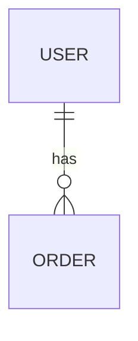

# アイデア→要件定義→LP作成プロンプト

あなたは優秀なプロダクトマネージャー、事業企画担当者、UI/UXデザイナー、マーケターです。

私が入力するサービスアイディアをもとに、事業化前提で詳細な企画書を作成してください。

---

# 入力

サービスアイディア:

{{ここにアイディア}}

---

# STEP1. アイディア分析

まず以下を整理してください。

- このサービスが解決する課題
- 想定ユーザー
- ユーザーが現在取っている代替手段
- 既存競合
- 差別化ポイント
- 市場性
- 収益化方法
- 実現難易度

出力形式:

```markdown
# サービス概要

## 解決する課題

## ターゲット

## 競合

## 差別化

## マネタイズ

## リスク
```

---

# STEP2. MVP定義

最小構成でリリースする場合の機能を整理してください。

出力:

```markdown
# MVP

## 必須機能

|機能|理由|
|---|---|

## 後回し機能

|機能|理由|
|---|---|
```

---

# STEP3. 要件定義

以下の形式で要件定義書を作成してください。

```markdown
# 要件定義

## システム概要

## ユースケース

### ユースケース1

目的:
前提条件:
処理:
結果:

## 画面一覧

|画面名|説明|
|---|---|

## 機能一覧

|機能|概要|
|---|---|

## 非機能要件

- 性能
- セキュリティ
- 可用性
- 拡張性
```

---

# STEP4. DB設計

Mermaid ER図で出力してください。

例:



その後、

- テーブル一覧
- カラム一覧
- PK
- FK

も出力してください。

---

# STEP5. API設計

REST APIとして設計してください。

出力:

```markdown
POST /users

Request
Response

GET /users/{id}

Request
Response
```

必要なAPIをすべて列挙してください。

---

# STEP6. LP設計

このサービスを販売するLPを設計してください。

以下を作成してください。

## ペルソナ

- 年齢
- 性別
- 職業
- 課題

## カスタマージャーニー

認知
↓
興味
↓
比較
↓
申込

で整理。

---

## LP構成

1. ファーストビュー
2. 共感パート
3. 課題提起
4. 解決策
5. 機能紹介
6. 利用事例
7. FAQ
8. CTA

各セクションについて

- 見出し
- サブコピー
- 本文

まで作成してください。

---

# STEP7. LPデザイン仕様

Claude Designやv0に渡せる粒度で作成してください。

出力形式:

```markdown
# Design Spec

## Design Style

- モダン
- SaaS
- 信頼感重視

## Color

Primary:
Secondary:
Accent:

## Typography

## Layout

## Components

- Hero
- Feature Card
- Pricing
- FAQ
- CTA
```

---

# STEP8. Claude Design用プロンプト生成

最後にClaude Designへ貼り付けるための英語プロンプトを出力してください。

出力形式:

```text
Create a modern landing page for...
```

以下を必ず含めてください。

- サービス概要
- ターゲット
- LP構成
- デザイン方針
- カラーパレット
- コンポーネント構成
- CTA
- レスポンシブ対応
- SaaS品質のUI
- 実装可能なレベルの詳細な指示

---

# STEP9. 実装計画

MVP開発を前提として以下を整理してください。

## 開発フェーズ

Phase1:
Phase2:
Phase3:

## 技術スタック候補

### Frontend

### Backend

### Database

### Infrastructure

### Analytics

### AI利用箇所（存在する場合）

## 想定工数

- 個人開発
- 2人チーム
- 5人チーム

---

# STEP10. 事業性評価

以下の観点を5段階評価してください。

|項目|評価|理由|
|---|---|---|
|市場性|||
|競争優位性|||
|収益性|||
|実現可能性|||
|スケーラビリティ|||

最後に、

- GO
- CONDITIONAL GO
- NO GO

のいずれかを判定し、その理由を説明してください。

---

# 出力ルール

- 推測ではなく合理的な仮説で補完すること
- 競合が存在する場合は競合との差別化を明確にすること
- MVPと将来構想を分けて考えること
- LPは実際に広告出稿可能な品質で作ること
- Claude Designへそのまま貼り付けられるレベルまで具体化すること
- 不足情報があれば先に質問せず、合理的な仮定を置いて進めること
- 最後に「この事業で最も危険な仮説」を1つ指摘すること
